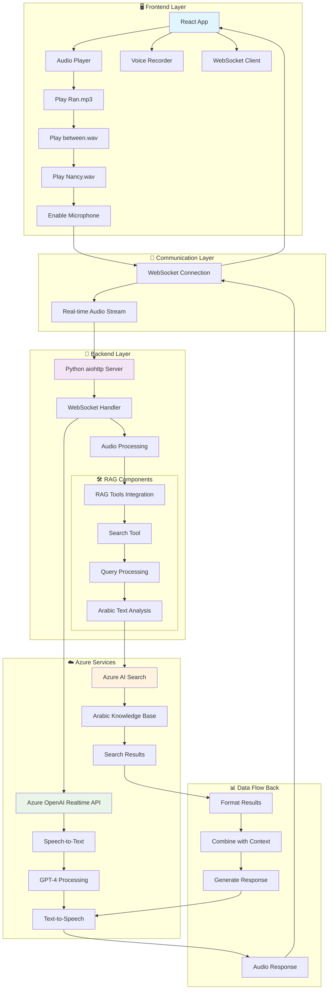
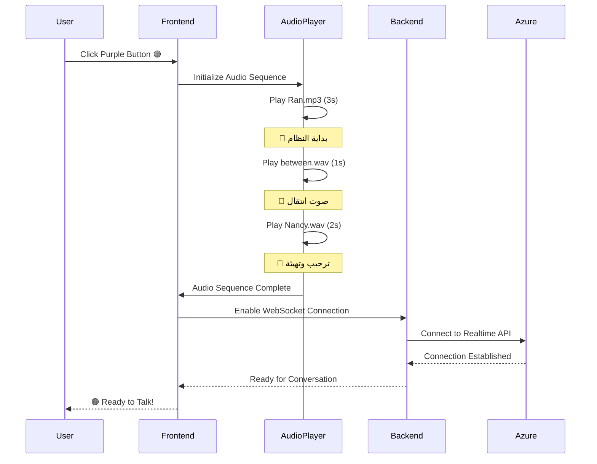
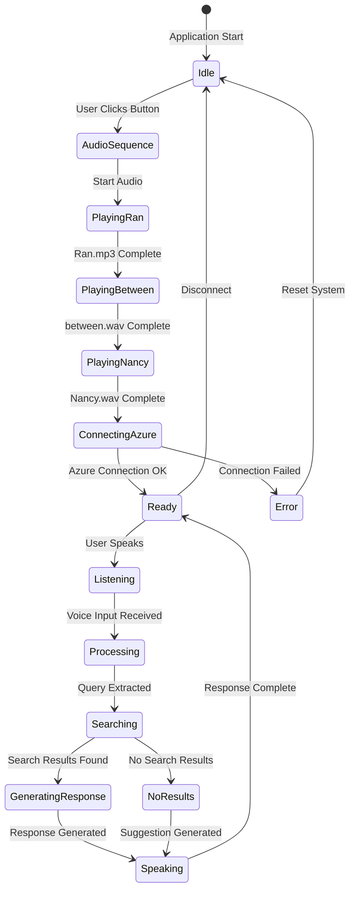
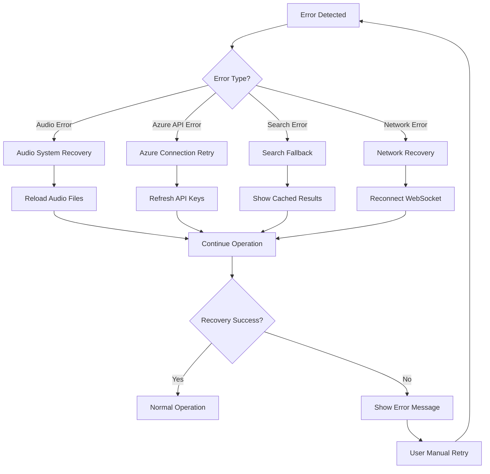

# 🏗️ الهندسة المعمارية المفصلة - RAG + Realtime API

## 🔄 مخطط التدفق الكامل (Complete Flow Diagram)



## 🎵 مخطط تسلسل الأصوات (Audio Sequence Diagram)



## 🔍 مخطط RAG المفصل (Detailed RAG Architecture)

```mermaid
graph LR
    subgraph "📝 Input Processing"
        A[User Voice Input] --> B[Speech Recognition]
        B --> C[Arabic Text Extraction]
        C --> D[Query Understanding]
    end

    subgraph "🔍 Search Engine"
        D --> E[Query Preprocessing]
        E --> F[Azure AI Search API]
        F --> G[Arabic Index Search]
        
        subgraph "📊 Search Configuration"
            G --> H[Simple Query Type]
            G --> I[Search Mode: Any]
            G --> J[Fields: ID, Name, ingredients, Price]
        end
    end

    subgraph "📋 Data Processing"
        J --> K[Result Filtering]
        K --> L[Arabic Content Processing]
        L --> M[Price & Ingredients Formatting]
        M --> N[Contextual Enhancement]
    end

    subgraph "🧠 AI Integration"
        N --> O[Context Injection]
        O --> P[GPT-4 Realtime Processing]
        P --> Q[Response Generation]
        Q --> R[Arabic Speech Synthesis]
    end

    subgraph "📤 Output Delivery"
        R --> S[Audio Response]
        S --> T[WebSocket Transmission]
        T --> U[Frontend Audio Player]
        U --> V[User Hearing Response]
    end

    style E fill:#ffebee
    style F fill:#e3f2fd
    style P fill:#e8f5e8
    style S fill:#fff3e0
```



## 🗂️ هيكل البيانات في Azure Search

```json
{
  "search_index": "new-circls-index",
  "document_structure": {
    "ID": {
      "type": "string",
      "searchable": true,
      "filterable": true,
      "description": "معرف فريد للمنتج"
    },
    "Name": {
      "type": "string", 
      "searchable": true,
      "analyzer": "ar.microsoft",
      "description": "اسم المنتج بالعربية"
    },
    "ingredients": {
      "type": "string",
      "searchable": true,
      "analyzer": "ar.microsoft", 
      "description": "مكونات المنتج بالعربية"
    },
    "Price": {
      "type": "string",
      "filterable": true,
      "description": "سعر المنتج بالجنيه"
    }
  },
  "example_documents": [
    {
      "ID": "1",
      "Name": "كالزونى فراخ كرسبي كبير",
      "ingredients": "صلصه - فلفل - زيتون - موتزريلا - فراخ كرسبي",
      "Price": "180"
    },
    {
      "ID": "3", 
      "Name": "طبق اونيون رينج",
      "ingredients": "طبق اونيون رينج",
      "Price": "30"
    }
  ]
}
```

## ⚙️ تكوين النظام (System Configuration)

```yaml
# Azure OpenAI Configuration
azure_openai:
  endpoint: "https://2050.openai.azure.com"
  deployment: "gpt-4o-mini-realtime-preview"
  voice: "alloy"
  features:
    - real_time_conversation
    - speech_to_text
    - text_to_speech
    - arabic_support

# Azure AI Search Configuration  
azure_search:
  endpoint: "https://neslst11mune.search.windows.net"
  index: "new-circls-index"
  query_type: "simple"
  search_mode: "any"
  language: "arabic"
  
# Audio Configuration
audio_system:
  sequence:
    - file: "Ran.mp3"
      duration: "3s"
      purpose: "system_start"
    - file: "between.wav" 
      duration: "1s"
      purpose: "transition"
    - file: "Nancy.wav"
      duration: "2s" 
      purpose: "welcome"
  
  realtime:
    sample_rate: 24000
    channels: 1
    format: "pcm16"
```

## 🔄 حالات النظام (System States)



## 🛡️ معالجة الأخطاء (Error Handling)



## 📊 مقاييس الأداء (Performance Metrics)

```yaml
performance_targets:
  audio_sequence:
    total_duration: "6 seconds"
    startup_time: "< 1 second"
    transition_smoothness: "seamless"
  
  search_performance:
    query_time: "< 200ms"
    result_accuracy: "> 95%"
    arabic_support: "full"
  
  realtime_api:
    response_time: "< 500ms"
    audio_quality: "24kHz/16bit"
    conversation_flow: "natural"
  
  system_resources:
    memory_usage: "< 512MB"
    cpu_usage: "< 30%"
    network_bandwidth: "< 1Mbps"
```

---

*هذا المخطط يوضح التكامل المتقن بين الأصوات الثلاثة، Realtime API، وRAG مع Azure AI Search* 🚀
