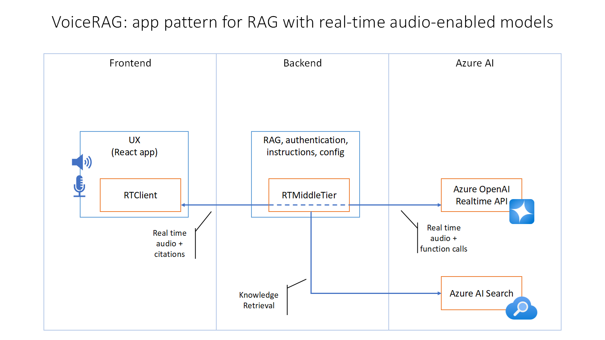
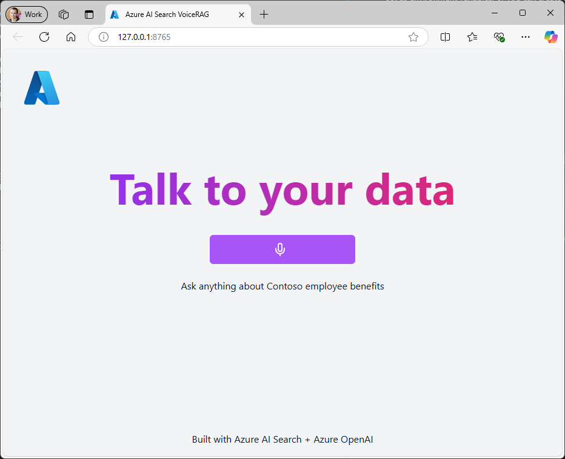

# VoiceRAG: An Application Pattern for RAG + Voice Using Azure AI Search and the GPT-4o Realtime API for Audio

[](https://github.com/codespaces/new?hide_repo_select=true&ref=main&skip_quickstart=true&machine=basicLinux32gb&repo=860141324&devcontainer_path=.devcontainer%2Fdevcontainer.json&geo=WestUs2)
[](https://vscode.dev/redirect?url=vscode://ms-vscode-remote.remote-containers/cloneInVolume?url=https://github.com/Azure-Samples/aisearch-openai-rag-audio)

This repo contains an example of how to implement RAG support in applications that use voice as their user interface, powered by the GPT-4o realtime API for audio. We describe the pattern in more detail in [this blog post](https://aka.ms/voicerag), and you can see this sample app in action in [this short video](https://youtu.be/vXJka8xZ9Ko).

* [Features](#features)
* [Architecture Diagram](#architecture-diagram)
* [Getting Started](#getting-started)
  * [GitHub Codespaces](#github-codespaces)
  * [VS Code Dev Containers](#vs-code-dev-containers)
  * [Local environment](#local-environment)
* [Deploying the app](#deploying-the-app)
* [Development server](#development-server)

## Features

* **Voice interface**: The app uses the browser's microphone to capture voice input, and sends it to the backend where it is processed by the Azure OpenAI GPT-4o Realtime API.
* **RAG (Retrieval Augmented Generation)**: The app uses the Azure AI Search service to answer questions about a knowledge base, and sends the retrieved documents to the GPT-4o Realtime API to generate a response.
* **Audio output**: The app plays the response from the GPT-4o Realtime API as audio, using the browser's audio capabilities.
* **Citations**: The app shows the search results that were used to generate the response.

### Architecture Diagram

The `RTClient` in the frontend receives the audio input, sends that to the Python backend which uses an `RTMiddleTier` object to interface with the Azure OpenAI real-time API, and includes a tool for searching Azure AI Search.



This repository includes infrastructure as code and a `Dockerfile` to deploy the app to Azure Container Apps, but it can also be run locally as long as Azure AI Search and Azure OpenAI services are configured.

## Getting Started

You have a few options for getting started with this template. The quickest way to get started is [GitHub Codespaces](#github-codespaces), since it will setup all the tools for you, but you can also [set it up locally](#local-environment). You can also use a [VS Code dev container](#vs-code-dev-containers)

### GitHub Codespaces

You can run this repo virtually by using GitHub Codespaces, which will open a web-based VS Code in your browser:

[](https://github.com/codespaces/new?hide_repo_select=true&ref=main&skip_quickstart=true&machine=basicLinux32gb&repo=860141324&devcontainer_path=.devcontainer%2Fdevcontainer.json&geo=WestUs2)

Once the codespace opens (this may take several minutes), open a new terminal and proceed to [deploy the app](#deploying-the-app).

### VS Code Dev Containers

You can run the project in your local VS Code Dev Container using the [Dev Containers extension](https://marketplace.visualstudio.com/items?itemName=ms-vscode-remote.remote-containers):

1. Start Docker Desktop (install it if not already installed)
2. Open the project:

    [](https://vscode.dev/redirect?url=vscode://ms-vscode-remote.remote-containers/cloneInVolume?url=https://github.com/azure-samples/aisearch-openai-rag-audio)
3. In the VS Code window that opens, once the project files show up (this may take several minutes), open a new terminal, and proceed to [deploying the app](#deploying-the-app).

### Local environment

1. Install the required tools:
   * [Azure Developer CLI](https://aka.ms/azure-dev/install)
   * [Node.js](https://nodejs.org/)
   * [Python >=3.11](https://www.python.org/downloads/)
      * **Important**: Python and the pip package manager must be in the path in Windows for the setup scripts to work.
      * **Important**: Ensure you can run `python --version` from console. On Ubuntu, you might need to run `sudo apt install python-is-python3` to link `python` to `python3`.
   * [Git](https://git-scm.com/downloads)
   * [Powershell](https://learn.microsoft.com/powershell/scripting/install/installing-powershell) - For Windows users only.

2. Clone the repo (`git clone https://github.com/Azure-Samples/aisearch-openai-rag-audio`)
3. Proceed to the next section to [deploy the app](#deploying-the-app).

## Deploying the app

The steps below will provision Azure resources and deploy the application code to Azure Container Apps.

1. Login to your Azure account:

    ```shell
    azd auth login
    ```

    For GitHub Codespaces users, if the previous command fails, try:

   ```shell
    azd auth login --use-device-code
    ```

1. Create a new azd environment:

    ```shell
    azd env new
    ```

    Enter a name that will be used for the resource group.
    This will create a new folder in the `.azure` folder, and set it as the active environment for any calls to `azd` going forward.

1. (Optional) This is the point where you can customize the deployment by setting azd environment variables, in order to [use existing services](docs/existing_services.md) or [customize the voice choice](docs/customizing_deploy.md).

1. Run this single command to provision the resources, deploy the code, and setup integrated vectorization for the sample data:

   ```shell
   azd up
   ````

   * **Important**: Beware that the resources created by this command will incur immediate costs, primarily from the AI Search resource. These resources may accrue costs even if you interrupt the command before it is fully executed. You can run `azd down` or delete the resources manually to avoid unnecessary spending.
   * You will be prompted to select two locations, one for the majority of resources and one for the OpenAI resource, which is currently a short list. That location list is based on the [OpenAI model availability table](https://learn.microsoft.com/azure/ai-services/openai/concepts/models#global-standard-model-availability) and may become outdated as availability changes.

1. After the application has been successfully deployed you will see a URL printed to the console.  Navigate to that URL to interact with the app in your browser. To try out the app, click the "Start conversation button", say "Hello", and then ask a question about your data like "What is the whistleblower policy for Contoso electronics?" You can also now run the app locally by following the instructions in [the next section](#development-server).

## Development server

You can run this app locally using either the Azure services you provisioned by following the [deployment instructions](#deploying-the-app), or by pointing the local app at already [existing services](docs/existing_services.md).

1. If you deployed with `azd up`, you should see a `app/backend/.env` file with the necessary environment variables.

2. If did *not* use `azd up`, you will need to create `app/backend/.env` file with the following environment variables:

   ```shell
   AZURE_OPENAI_ENDPOINT=wss://<your instance name>.openai.azure.com
   AZURE_OPENAI_REALTIME_DEPLOYMENT=gpt-4o-realtime-preview
   AZURE_OPENAI_REALTIME_VOICE_CHOICE=<choose one: echo, alloy, shimmer>
   AZURE_OPENAI_API_KEY=<your api key>
   AZURE_SEARCH_ENDPOINT=https://<your service name>.search.windows.net
   AZURE_SEARCH_INDEX=<your index name>
   AZURE_SEARCH_API_KEY=<your api key>
   ```

   To use Entra ID (your user when running locally, managed identity when deployed) simply don't set the keys.

3. Run this command to start the app:

   Windows:

   ```pwsh
   pwsh .\scripts\start.ps1
   ```

   Linux/Mac:

   ```bash
   ./scripts/start.sh
   ```

4. The app is available on [http://localhost:8765](http://localhost:8765).

   Once the app is running, when you navigate to the URL above you should see the start screen of the app:
   

   To try out the app, click the "Start conversation button", say "Hello", and then ask a question about your data like "What is the whistleblower policy for Contoso electronics?"

## Guidance

### Costs

Pricing varies per region and usage, so it isn't possible to predict exact costs for your usage.
However, you can try the [Azure pricing calculator](https://azure.com/e/a87a169b256e43c089015fda8182ca87) for the resources below.

* Azure Container Apps: Consumption plan with 1 CPU core, 2.0 GB RAM. Pricing with Pay-as-You-Go. [Pricing](https://azure.microsoft.com/pricing/details/container-apps/)
* Azure OpenAI: Standard tier, gpt-4o-realtime and text-embedding-3-large models. Pricing per 1K tokens used. [Pricing](https://azure.microsoft.com/pricing/details/cognitive-services/openai-service/)
* Azure AI Search: Standard tier, 1 replica, free level of semantic search. Pricing per hour. [Pricing](https://azure.microsoft.com/pricing/details/search/)
* Azure Blob Storage: Standard tier with ZRS (Zone-redundant storage). Pricing per storage and read operations. [Pricing](https://azure.microsoft.com/pricing/details/storage/blobs/)
* Azure Monitor: Pay-as-you-go tier. Costs based on data ingested. [Pricing](https://azure.microsoft.com/pricing/details/monitor/)

To reduce costs, you can switch to free SKUs for various services, but those SKUs have limitations.

⚠️ To avoid unnecessary costs, remember to take down your app if it's no longer in use,
either by deleting the resource group in the Portal or running `azd down`.

### Security

This template uses [Managed Identity](https://learn.microsoft.com/entra/identity/managed-identities-azure-resources/overview) to eliminate the need for developers to manage these credentials. Applications can use managed identities to obtain Microsoft Entra tokens without having to manage any credentials.To ensure best practices in your repo we recommend anyone creating solutions based on our templates ensure that the [Github secret scanning](https://docs.github.com/code-security/secret-scanning/about-secret-scanning) setting is enabled in your repos.

### Notes

>Sample data: The PDF documents used in this demo contain information generated using a language model (Azure OpenAI Service). The information contained in these documents is only for demonstration purposes and does not reflect the opinions or beliefs of Microsoft. Microsoft makes no representations or warranties of any kind, express or implied, about the completeness, accuracy, reliability, suitability or availability with respect to the information contained in this document. All rights reserved to Microsoft.

## Resources

* [Blog post: VoiceRAG](https://aka.ms/voicerag)
* [Demo video: VoiceRAG](https://youtu.be/vXJka8xZ9Ko)
* [Azure OpenAI Realtime Documentation](https://github.com/Azure-Samples/aoai-realtime-audio-sdk/)