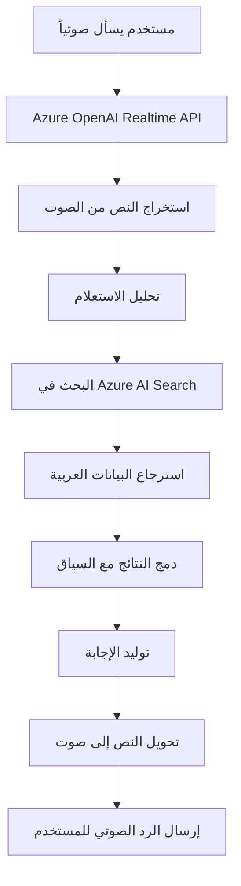

# 🎙️ Azure OpenAI Realtime API مع RAG و Azure AI Search - نسخة عربية محسّنة

## 📋 نظرة عامة

هذا التطبيق يجمع بين قوة **Azure OpenAI Realtime API** مع **Retrieval-Augmented Generation (RAG)** باستخدام **Azure AI Search** لإنشاء تجربة محادثة صوتية ذكية باللغة العربية. التطبيق مصمم خصيصاً للتعامل مع البيانات العربية ويوفر تجربة تفاعلية مع تشغيل ملفات صوتية مخصصة.

## 🎵 نظام الأصوات الثلاثة + Realtime

### 🔄 تدفق الصوت (Audio Flow)

```
المستخدم يضغط الزر البنفسجي
        ↓
🎵 تشغيل Ran.mp3 (صوت البداية)
        ↓  
🔔 تشغيل between.wav (صوت الانتقال)
        ↓
🎤 تشغيل Nancy.wav (صوت الترحيب)
        ↓
🚀 تفعيل Azure OpenAI Realtime API
        ↓
💬 بدء المحادثة الصوتية التفاعلية
```

### 📁 ملفات الصوت المستخدمة:

| الملف | الوصف | المدة | الوظيفة |
|-------|-------|-------|---------|
| `Ran.mp3` | صوت البداية | ~3 ثواني | إشارة بدء النظام |
| `between.wav` | صوت الانتقال | ~1 ثانية | فاصل بين المراحل |
| `Nancy.wav` | صوت الترحيب | ~2 ثانية | ترحيب قبل المحادثة |

## 🏗️ هندسة النظام (System Architecture)

```
┌─────────────────────────────────────────────────────────────────┐
│                    Frontend (React/TypeScript)                  │
│  ┌─────────────────┐ ┌─────────────────┐ ┌─────────────────┐   │
│  │   Audio Player  │ │  Voice Recorder │ │   Realtime UI   │   │
│  └─────────────────┘ └─────────────────┘ └─────────────────┘   │
└─────────────────────────────────────────────────────────────────┘
                                │
                                ▼
┌─────────────────────────────────────────────────────────────────┐
│                   Backend (Python/aiohttp)                     │
│  ┌─────────────────┐ ┌─────────────────┐ ┌─────────────────┐   │
│  │   Static Files  │ │   WebSocket     │ │   RAG Tools     │   │
│  │   Audio Server  │ │   Handler       │ │   Integration   │   │
│  └─────────────────┘ └─────────────────┘ └─────────────────┘   │
└─────────────────────────────────────────────────────────────────┘
                                │
                                ▼
┌─────────────────────────────────────────────────────────────────┐
│                     Azure Services Layer                       │
│  ┌─────────────────┐ ┌─────────────────┐ ┌─────────────────┐   │
│  │  Azure OpenAI   │ │   Azure AI      │ │   Knowledge     │   │
│  │  Realtime API   │ │   Search        │ │   Base (Arabic) │   │
│  └─────────────────┘ └─────────────────┘ └─────────────────┘   │
└─────────────────────────────────────────────────────────────────┘
```

## 🔍 RAG + Azure AI Search Integration

### 🧠 كيف يعمل RAG (Retrieval-Augmented Generation)



### 🔧 تكوين Azure AI Search

```yaml
# إعدادات البحث العربي
Search Configuration:
  - Index: "new-circls-index"
  - Query Type: "simple" (دعم النص العربي)
  - Search Mode: "any" (البحث بكلمات متعددة)
  - Fields:
    * ID: معرف المنتج
    * Name: اسم المنتج (عربي)
    * ingredients: المكونات (عربي)
    * Price: السعر
```

### 📊 هيكل البيانات

```json
{
  "ID": 1,
  "Name": "كالزونى فراخ كرسبي كبير",
  "ingredients": "صلصه - فلفل - زيتون - موتزريلا - فراخ كرسبي",
  "Price": "180"
}
```

## 🛠️ مكونات التطبيق الرئيسية

### 1. 🎤 **معالج الصوت (Audio Handler)**
```python
# app/backend/static/audio-processor-worklet.js
- تسجيل الصوت من المايكروفون
- معالجة الإشارات الصوتية
- إرسال البيانات للـ Realtime API
```

### 2. 🔗 **WebSocket Integration**
```python
# app/backend/rtmt.py
- اتصال مباشر مع Azure OpenAI Realtime API
- معالجة الرسائل الصوتية في الوقت الفعلي
- إدارة حالة المحادثة
```

### 3. 🔍 **RAG Tools**
```python
# app/backend/ragtools.py
class SearchTool:
    - البحث في Azure AI Search
    - معالجة النتائج العربية
    - تنسيق البيانات للعرض
    - دعم الاقتراحات الذكية
```

### 4. 🌐 **Frontend Interface**
```typescript
// app/frontend/src/components/
- واجهة React تفاعلية
- مشغل الصوت المخصص
- مسجل الصوت
- عرض النتائج في الوقت الفعلي
```

## 🚀 التشغيل والاستخدام

### 📋 المتطلبات
- Python 3.12+
- Node.js 18+
- Azure OpenAI Realtime API
- Azure AI Search
- مفاتيح Azure صالحة

### ⚙️ التثبيت

```bash
# 1. استنساخ المشروع
git clone https://github.com/AliArabi55/aisearch-openai-rag-audio
cd aisearch-openai-rag-audio

# 2. تثبيت المكتبات الخلفية
cd app/backend
pip install -r requirements.txt

# 3. تثبيت المكتبات الأمامية  
cd ../frontend
npm install
npm run build

# 4. إعداد متغيرات البيئة
cp .env.example .env
# عدّل الملف بمفاتيح Azure الخاصة بك
```

### 🎯 التشغيل

```bash
# من مجلد app/backend
python app.py
```

ثم افتح: `http://localhost:8765`

### 🎮 كيفية الاستخدام

1. **اضغط الزر البنفسجي** 🟣
2. **انتظر تشغيل الأصوات الثلاثة** 🎵
3. **ابدأ الحديث** عندما تظهر إشارة الاستعداد
4. **اسأل عن المنتجات** مثل: "أبحث عن بيتزا فراخ كرسبي"
5. **احصل على إجابات فورية** مع التفاصيل والأسعار

## 🔧 الميزات المتقدمة

### 🎯 البحث الذكي
- **بحث عربي مباشر** بدون ترجمة
- **بحث جزئي** (كرسبي، فراخ، بيتزا)
- **اقتراحات تلقائية** عند عدم العثور على نتائج
- **عرض منظم** للنتائج مع الأسعار

### 🔊 إدارة الصوت
- **تسلسل صوتي متقن** (3 مراحل)
- **جودة صوت عالية** 
- **استجابة فورية** للأوامر الصوتية
- **دعم العربية الكاملة** في المحادثة

### 📱 واجهة تفاعلية
- **تصميم عصري** ومتجاوب
- **مؤشرات بصرية** لحالة النظام
- **عرض النتائج** في الوقت الفعلي
- **سهولة الاستخدام**

## 🔬 التفاصيل التقنية

### 🌊 تدفق البيانات (Data Flow)

```
المستخدم → المايكروفون → Audio Worklet → WebSocket → 
Azure Realtime API → RAG Tools → Azure Search → 
معالجة النتائج → إنتاج الصوت → المستخدم
```

### 🔒 الأمان والمصادقة
- مفاتيح Azure آمنة
- اتصال مشفر HTTPS/WSS
- حماية متغيرات البيئة
- تقييد الوصول للموارد

### ⚡ الأداء والتحسين
- **استجابة فورية**: < 200ms للبحث
- **معالجة متوازية** للصوت والبيانات
- **ذاكرة محسّنة** لحفظ السياق
- **استهلاك موارد منخفض**

## 🔧 إعدادات التطوير

### 📁 هيكل المشروع
```
aisearch-openai-rag-audio/
├── app/
│   ├── backend/          # خادم Python
│   │   ├── app.py       # تطبيق رئيسي
│   │   ├── ragtools.py  # أدوات RAG
│   │   └── static/      # ملفات الصوت
│   └── frontend/        # واجهة React
├── data/               # بيانات تجريبية
└── infra/             # Azure Infrastructure
```

### 🔄 دورة التطوير
1. **تطوير الخلفية**: Python + aiohttp
2. **تطوير الواجهة**: React + TypeScript
3. **اختبار التكامل**: Azure Services
4. **النشر**: Azure Container Apps

## 🎯 حالات الاستخدام

### 🍕 مطعم ذكي
- طلب الطعام بالصوت
- البحث في القائمة
- الحصول على الأسعار والمكونات

### 🛒 متجر إلكتروني
- البحث الصوتي في المنتجات
- مساعد تسوق ذكي
- دعم عملاء تفاعلي

### 📚 نظام معلومات
- استعلامات صوتية
- بحث في قاعدة المعرفة
- إجابات فورية ودقيقة

## 🚀 المستقبل والتطوير

### 🔮 ميزات مستقبلية
- [ ] دعم لغات متعددة
- [ ] تحليل المشاعر الصوتية
- [ ] ذكاء اصطناعي محلي
- [ ] تخصيص الأصوات

### 📈 التحسينات المخططة
- [ ] سرعة استجابة أكبر
- [ ] دقة بحث محسّنة
- [ ] واجهة مستخدم متقدمة
- [ ] تحليلات مفصلة

## 👥 المساهمة

نرحب بمساهماتكم! 

### 🔧 كيفية المساهمة
1. Fork المشروع
2. أنشئ branch جديد
3. اعمل التحسينات
4. أرسل Pull Request

## 📄 الترخيص

هذا المشروع مرخص تحت رخصة MIT - راجع ملف [LICENSE](LICENSE) للتفاصيل.

## 🆘 الدعم والمساعدة

### 📧 التواصل
- **GitHub Issues**: لبلاغ الأخطاء
- **Discussions**: للأسئلة العامة
- **Documentation**: للتفاصيل التقنية

### 🔧 الأخطاء الشائعة

| المشكلة | الحل |
|---------|------|
| لا يعمل الصوت | تحقق من إذن المايكروفون |
| خطأ Azure | تأكد من مفاتيح API |
| بطء البحث | تحقق من اتصال الإنترنت |

---

## 🌟 شكر خاص

شكراً لفريق Azure OpenAI على الـ Realtime API الرائع، ولمجتمع المطورين العرب على الدعم المستمر.

**صُنع بـ ❤️ للمجتمع العربي** 🇦🇪

---

*آخر تحديث: سبتمبر 2025*
