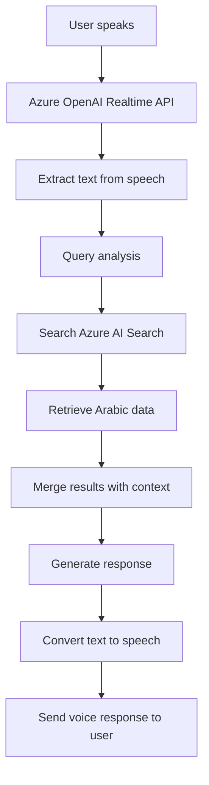

# 🎙️ Azure OpenAI Realtime API with RAG & Azure AI Search - English Edition

## 📋 Overview

This application combines the power of **Azure OpenAI Realtime API** with **Retrieval-Augmented Generation (RAG)** using **Azure AI Search** to create an intelligent Arabic voice conversation experience. The app is specifically designed to handle Arabic data and provides an interactive experience with custom audio file playback.

## 🎵 3-Sound Audio System + Realtime

### 🔄 Audio Flow

```
User Clicks Purple Button
        ↓
🎵 Play Ran.mp3 (System Start - 3s)
        ↓  
🔔 Play between.wav (Transition - 1s)
        ↓
🎤 Play Nancy.wav (Welcome - 2s)
        ↓
🚀 Activate Azure OpenAI Realtime API
        ↓
💬 Interactive Voice Conversation Ready
```

### 📁 Audio Files Used:

| File | Description | Duration | Function |
|------|-------------|----------|----------|
| `Ran.mp3` | System startup sound | ~3 seconds | System initialization signal |
| `between.wav` | Transition sound | ~1 second | Stage transition |
| `Nancy.wav` | Welcome message | ~2 seconds | Pre-conversation greeting |

## 🏗️ System Architecture

```
┌─────────────────────────────────────────────────────────────────┐
│                    Frontend (React/TypeScript)                  │
│  ┌─────────────────┐ ┌─────────────────┐ ┌─────────────────┐   │
│  │   Audio Player  │ │  Voice Recorder │ │   Realtime UI   │   │
│  └─────────────────┘ └─────────────────┘ └─────────────────┘   │
└─────────────────────────────────────────────────────────────────┘
                                │
                                ▼
┌─────────────────────────────────────────────────────────────────┐
│                   Backend (Python/aiohttp)                     │
│  ┌─────────────────┐ ┌─────────────────┐ ┌─────────────────┐   │
│  │   Static Files  │ │   WebSocket     │ │   RAG Tools     │   │
│  │   Audio Server  │ │   Handler       │ │   Integration   │   │
│  └─────────────────┘ └─────────────────┘ └─────────────────┘   │
└─────────────────────────────────────────────────────────────────┘
                                │
                                ▼
┌─────────────────────────────────────────────────────────────────┐
│                     Azure Services Layer                       │
│  ┌─────────────────┐ ┌─────────────────┐ ┌─────────────────┐   │
│  │  Azure OpenAI   │ │   Azure AI      │ │   Knowledge     │   │
│  │  Realtime API   │ │   Search        │ │   Base (Arabic) │   │
│  └─────────────────┘ └─────────────────┘ └─────────────────┘   │
└─────────────────────────────────────────────────────────────────┘
```

## 🔍 RAG + Azure AI Search Integration

### 🧠 How RAG (Retrieval-Augmented Generation) Works



### 🔧 Azure AI Search Configuration

```yaml
# Arabic Search Settings
Search Configuration:
  - Index: "new-circls-index"
  - Query Type: "simple" (Arabic text support)
  - Search Mode: "any" (multi-keyword search)
  - Fields:
    * ID: Product identifier
    * Name: Product name (Arabic)
    * ingredients: Ingredients (Arabic)
    * Price: Price
```

### 📊 Data Structure

```json
{
  "ID": 1,
  "Name": "كالزونى فراخ كرسبي كبير",
  "ingredients": "صلصه - فلفل - زيتون - موتزريلا - فراخ كرسبي",
  "Price": "180"
}
```

## 🛠️ Main Application Components

### 1. 🎤 **Audio Handler**
```python
# app/backend/static/audio-processor-worklet.js
- Record audio from microphone
- Process audio signals
- Send data to Realtime API
```

### 2. 🔗 **WebSocket Integration**
```python
# app/backend/rtmt.py
- Direct connection with Azure OpenAI Realtime API
- Process voice messages in real-time
- Manage conversation state
```

### 3. 🔍 **RAG Tools**
```python
# app/backend/ragtools.py
class SearchTool:
    - Search in Azure AI Search
    - Process Arabic results
    - Format data for display
    - Support smart suggestions
```

### 4. 🌐 **Frontend Interface**
```typescript
// app/frontend/src/components/
- Interactive React interface
- Custom audio player
- Voice recorder
- Real-time results display
```

## 🚀 Installation and Usage

### 📋 Requirements
- Python 3.12+
- Node.js 18+
- Azure OpenAI Realtime API
- Azure AI Search
- Valid Azure keys

### ⚙️ Installation

```bash
# 1. Clone the project
git clone https://github.com/AliArabi55/aisearch-openai-rag-audio
cd aisearch-openai-rag-audio

# 2. Install backend dependencies
cd app/backend
pip install -r requirements.txt

# 3. Install frontend dependencies  
cd ../frontend
npm install
npm run build

# 4. Setup environment variables
cp .env.example .env
# Edit the file with your Azure keys
```

### 🎯 Running the Application

```bash
# From app/backend directory
python app.py
```

Then open: `http://localhost:8765`

### 🎮 How to Use

1. **Click the purple button** 🟣
2. **Wait for the 3-sound sequence** 🎵
3. **Start speaking** when ready indicator appears
4. **Ask about products** like: "I want crispy chicken pizza"
5. **Get instant responses** with details and prices

## 🔧 Advanced Features

### 🎯 Smart Search
- **Direct Arabic search** without translation
- **Partial search** (crispy, chicken, pizza)
- **Automatic suggestions** when no results found
- **Organized display** of results with prices

### 🔊 Audio Management
- **Professional 3-stage sequence** 
- **High audio quality** 
- **Instant response** to voice commands
- **Full Arabic support** in conversation

### 📱 Interactive Interface
- **Modern responsive design**
- **Visual system status indicators**
- **Real-time results display**
- **User-friendly experience**

## 🔬 Technical Details

### 🌊 Data Flow

```
User → Microphone → Audio Worklet → WebSocket → 
Azure Realtime API → RAG Tools → Azure Search → 
Process Results → Generate Audio → User
```

### 🔒 Security and Authentication
- Secure Azure keys
- Encrypted HTTPS/WSS connection
- Protected environment variables
- Restricted resource access

### ⚡ Performance and Optimization
- **Instant response**: < 200ms for search
- **Parallel processing** for audio and data
- **Optimized memory** for context preservation
- **Low resource consumption**

## 🔧 Development Settings

### 📁 Project Structure
```
aisearch-openai-rag-audio/
├── app/
│   ├── backend/          # Python server
│   │   ├── app.py       # Main application
│   │   ├── ragtools.py  # RAG tools
│   │   └── static/      # Audio files
│   └── frontend/        # React interface
├── data/               # Sample data
└── infra/             # Azure Infrastructure
```

### 🔄 Development Cycle
1. **Backend Development**: Python + aiohttp
2. **Frontend Development**: React + TypeScript
3. **Integration Testing**: Azure Services
4. **Deployment**: Azure Container Apps

## 🎯 Use Cases

### 🍕 Smart Restaurant
- Voice food ordering
- Menu search
- Get prices and ingredients

### 🛒 E-commerce Store
- Voice product search
- Smart shopping assistant
- Interactive customer support

### 📚 Information System
- Voice queries
- Knowledge base search
- Instant accurate answers

## 🚀 Future Development

### 🔮 Future Features
- [ ] Multi-language support
- [ ] Voice emotion analysis
- [ ] Local AI
- [ ] Voice customization

### 📈 Planned Improvements
- [ ] Faster response speed
- [ ] Enhanced search accuracy
- [ ] Advanced user interface
- [ ] Detailed analytics

## 👥 Contributing

We welcome your contributions! 

### 🔧 How to Contribute
1. Fork the project
2. Create new branch
3. Make improvements
4. Send Pull Request

## 📄 License

This project is licensed under the MIT License - see the [LICENSE](LICENSE) file for details.

## 🆘 Support and Help

### 📧 Contact
- **GitHub Issues**: For bug reports
- **Discussions**: For general questions
- **Documentation**: For technical details

### 🔧 Common Issues

| Problem | Solution |
|---------|----------|
| Audio not working | Check microphone permissions |
| Azure error | Verify API keys |
| Slow search | Check internet connection |

---

## 🌟 Special Thanks

Thanks to the Azure OpenAI team for the amazing Realtime API, and to the Arab developer community for continuous support.

**Made with ❤️ for the global developer community** 🌍

---

*Last updated: September 2025*
